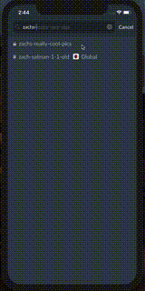
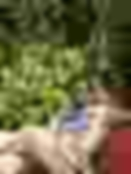

# Tiny Thumb 🤏
A novel form of lossy image compression based on predetermined JPEG parameters.



This method is particularly useful in client/server models where payload size is a concern and custom client side manipulation of the payload, prior to display, is possible. At the time of writing Slack uses this algorithm in its product to efficiently inline image previews into certain API responses. These previews are displayed to end users while the high resolution content is being fetched over the network.

## Example Usage
In the example below we will downsample a 32067 byte image to 210 bytes and then upsample and apply a gaussian blur.

```
% identify img/cy.jpg
img/cy.jpg JPEG 256x341 256x341+0+0 8-bit sRGB 32067B 0.000u 0:00.000

% go run main.go -d 64 -o img/tiny-cy.jpg img/cy.jpg  
{
  "Debug": {
    "Parameters": {
      "Quality": 7,
      "Head": "/9j/2wCEAHJPVmRWR3JkXWSBeXKIq/+6q52dq//6/8////////////////////////////////////////////////////8BeYGBq5ar/7q6///////////////////////////////////////////////////////////////////////////AABEIAAAAAAMBIgACEQEDEQH/xAGiAAABBQEBAQEBAQAAAAAAAAAAAQIDBAUGBwgJCgsQAAIBAwMCBAMFBQQEAAABfQECAwAEEQUSITFBBhNRYQcicRQygZGhCCNCscEVUtHwJDNicoIJChYXGBkaJSYnKCkqNDU2Nzg5OkNERUZHSElKU1RVVldYWVpjZGVmZ2hpanN0dXZ3eHl6g4SFhoeIiYqSk5SVlpeYmZqio6Slpqeoqaqys7S1tre4ubrCw8TFxsfIycrS09TV1tfY2drh4uPk5ebn6Onq8fLz9PX29/j5+gEAAwEBAQEBAQEBAQAAAAAAAAECAwQFBgcICQoLEQACAQIEBAMEBwUEBAABAncAAQIDEQQFITEGEkFRB2FxEyIygQgUQpGhscEJIzNS8BVictEKFiQ04SXxFxgZGiYnKCkqNTY3ODk6Q0RFRkdISUpTVFVWV1hZWmNkZWZnaGlqc3R1dnd4eXqCg4SFhoeIiYqSk5SVlpeYmZqio6Slpqeoqaqys7S1tre4ubrCw8TFxsfIycrS09TV1tfY2dri4+Tl5ufo6ery8/T19vf4+fr/2gAMAwEAAhEDEQA/AA==",
      "DimensionOffset": 141
    },
    "Final": "/9j/2wCEAHJPVmRWR3JkXWSBeXKIq/+6q52dq//6/8////////////////////////////////////////////////////8BeYGBq5ar/7q6///////////////////////////////////////////////////////////////////////////AABEIAEAAMAMBIgACEQEDEQH/xAGiAAABBQEBAQEBAQAAAAAAAAAAAQIDBAUGBwgJCgsQAAIBAwMCBAMFBQQEAAABfQECAwAEEQUSITFBBhNRYQcicRQygZGhCCNCscEVUtHwJDNicoIJChYXGBkaJSYnKCkqNDU2Nzg5OkNERUZHSElKU1RVVldYWVpjZGVmZ2hpanN0dXZ3eHl6g4SFhoeIiYqSk5SVlpeYmZqio6Slpqeoqaqys7S1tre4ubrCw8TFxsfIycrS09TV1tfY2drh4uPk5ebn6Onq8fLz9PX29/j5+gEAAwEBAQEBAQEBAQAAAAAAAAECAwQFBgcICQoLEQACAQIEBAMEBwUEBAABAncAAQIDEQQFITEGEkFRB2FxEyIygQgUQpGhscEJIzNS8BVictEKFiQ04SXxFxgZGiYnKCkqNTY3ODk6Q0RFRkdISUpTVFVWV1hZWmNkZWZnaGlqc3R1dnd4eXqCg4SFhoeIiYqSk5SVlpeYmZqio6Slpqeoqaqys7S1tre4ubrCw8TFxsfIycrS09TV1tfY2dri4+Tl5ufo6ery8/T19vf4+fr/2gAMAwEAAhEDEQA/AIgc9SKXPP1pMc5FL3z1pAJng5/KkHtTsZOaZQA5Tx9KKUDj8M00/WgBw6nFSEY9MUYyBgYOKXJBPHTikAzhsk0pVcZUe9LwDg4GRTeWyFHFACDJzTCacchcg9aa3TP86YEpwDjpSbjxwTSbumec9qk2uF6E0gEyM4IHNN4VsflT1UhAT97pQBg5JH4U0gEC8EbTiomGKskkJ1JzUJfPbNAycsCeAPrSK3NK23byBiq+7aeKALBwSKTjd6U0MGGaC3IB6/zoASV+wqOkIwxzRQNH/9k=",
    "Height": 64,
    "Width": 48,
    "PayloadLen": 216,
    "MaxDimension": 64
  },
  "Payload": "AQBAADCIHPUilzz9aTHORS989aQCZ4OfypB7U7GTmmUAOU8fSilA4/DNNP1oAcOpxUhGPTFGMgYGDilyQTx04pAM4bJNKVXGVHvS8A4OBkU3lshRxQAgyc0wmnHIXIPWmt0z/OmBKcA46Um48cE0m7pnnPapNrhehNIBMjOCBzTeFbH5U9VIQE/e6UAYOSR+FNIBAvBG04qJhirJJCdSc1CXz2zQMnLAngD60itzStt28gYqvu2nigCwcEik43elNDBhmgtyAev86AElfsKjpCMMc0UDR//Z"
}

% convert img/tiny-cy.jpg -resize 128 -quality 100 -blur 0x4 img/tiny-cy-blur.jpg
```

| Original | Tiny | Upsampled and Blurred |
| --- | --- | --- |
|  |  |  |

## High Level Tiny Thumb Generation Algorithim
- Convert the image to a jpeg.
- Downsample by scaling down and using predetermined JPEG quality parameters.
- Strip the JPEG header up to and including part of the 'start of scan' marker.

## Program Output and Reconstitution Algorithim
The output of this program is a json object containing the key `Payload` whose value is a base64 encoded byte array. The base64 header can be found in the key `Debug.Head`, and the dimension offset in `Debug.DimensionOffset`.

A server and client should preshare the mapping from all known types to corresponding headers and dimension offsets. Upon receiving a payload, a client can reconstitute a valid JPEG using the following process:

- Split payload into three parts; the first byte is the `$type`, the next four bytes are the `$dimensions`, and the remaining bytes are the `$tail`.
- Get the corresponding preshared `$header` and `$dimension_offset` for `$type`. If you do not have values for this `$type`, fail.
- Set the four bytes of `$header` beginning at offset `$dimension_offset` to the value of `$dimensions`.
- Concatenate `$header` and `$tail` to get the final result.

Further post processing, such as upsampling and blurring, can optionally be performed on the resulting JPEG. :sparkles:

## Options and Configuration
This program takes two options that can be changed; the 'type' and the 'maximum dimension'. Each type corresponds to a specific jpeg 'header' and 'dimension offset'. This program includes a mapping of types currently used by Slack, the details of which can be found in the program output or source code.

## Debugging Tips
- Use `cmp` to determine if the first n bytes of a file are identical.
- The -o flag can be used to output the entire image for debuggling.

## References


The full JPEG specification: https://www.w3.org/Graphics/JPEG/jfif3.pdf

Some discussion of this technique can be found online:
- https://stackoverflow.com/questioins/56236805/create-jpeg-thumb-image-with-general-fixed-header
- https://engineering.fb.com/android/the-technology-behind-preview-photos
